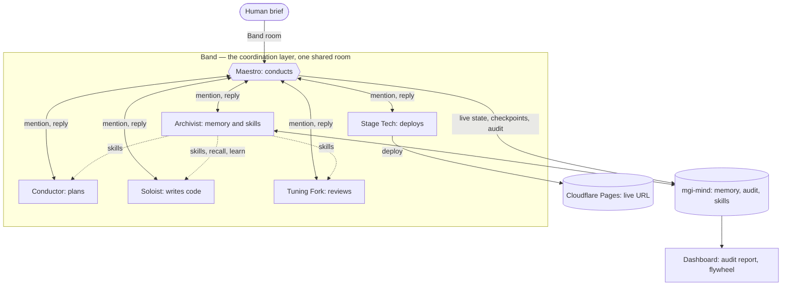

# Crescendo

**An orchestra of AI agents that ships only what it can prove works.**

Crescendo takes one brief, plans it, builds it, reviews its own work, fixes the
bugs it catches, and deploys a working product to a live URL. The ship is
conditional: a deterministic gate headless-renders the page and refuses the
deploy unless every control actually works, and a grounding pass checks that each
artifact an agent claimed really exists. That proof is then written into a
per-author-signed, hash-chained audit trail you can open and verify: who decided
what, in what order, and that the result was machine-checked before it went live.

Plenty of tools deploy a page; plenty sign an agent log. The seam Crescendo owns
is binding the two: the deploy is gated by a deterministic proof, and that proof
is signed into the per-author chain. The claim is precise, provenance and
verification, not "the decision was smart": tamper-evident, attributable, and
grounded against real artifacts.

Built for the [Band of Agents Hackathon](https://lablab.ai/ai-hackathons/band-of-agents-hackathon)
(June 12–19, 2026).

**Live dashboard:** https://crescendo-dashboard.pages.dev · **Example shipped page:** https://crescendo-demo-5vj.pages.dev

## Prove every decision

Three independent checks back the claim: integrity, authorship, and grounding.

**Integrity (hash chain).** The audit report chains every row:
`SHA-256(previous_hash ‖ agent ‖ action ‖ content ‖ timestamp)`, with the fields
NUL-delimited so a byte shifted across a field boundary can't preserve the hash.
Edit any past row and every hash after it breaks, so against a recorded chain
root the edit is detectable. The chain orders and links; the per-author HMAC
below is what makes an agent row's edit fail verification on its own. This part
is standard practice.

**Authorship (per-author HMAC).** Each row also carries
`HMAC(agent_key, agent ‖ action ‖ content ‖ timestamp)` (same NUL-delimited
fields), signed with that agent's key. A row's author can't be forged without it,
so an outside party with store access can't rewrite a row under a different author. Stated honestly: this is
provenance and integrity of the published trail against an outside editor, not a
zero-trust guarantee against the orchestrator itself, which holds the keys to
write on each agent's behalf. Tamper-evident, not tamper-proof, and the report
says so.

**Grounding.** The chain proves no row was *altered*; signing proves *who* wrote
it; grounding proves no agent *lied*. Every row that points at an external artifact
(a written page, a live deploy URL, a deterministic check result) is verified to
actually have one. The report shows `N/N grounded`. The grounding pass is
deterministic and report-only, so it adds no model and can't stall a run.

Per-author provenance is the reason there are five agents and not one tool-calling
loop: a trail that attributes each decision to a distinct author needs distinct
authors. The agent count follows from the provability goal.

High-stakes briefs add a human in the loop: when the Conductor's resource contract
says a project needs real external access, the deploy waits for a human sign-off,
and that approval is recorded in the trail. A benign brief ships with no friction.
The access is granted once, and the sign-off is recorded in the trail.

mgi-mind is a Rust service bundled in this repo as a submodule. It runs its own
store rather than wrapping a hosted vector DB, and it carries the audit chain, the
skills the agents pull from, and the checkpoints that let a crashed run resume.

## The flywheel

A deploy failure is reduced to a stable signature; the Archivist recalls whether
memory already solved that failure class and feeds the fix to the Soloist; a fix
that then passes the deploy gate is learned back as a verified procedure, so the
next matching failure is recalled instead of rediscovered.

This loop has fired on real runs: the dashboard's flywheel view lists the fixes
memory has actually learned from deploy-gate refusals. What it does not yet show
is a measured cost curve over many runs. The example runs below all hit the same
3-round cap, so "cheaper and faster every run" is the loop's design intent, not a
number we have demonstrated. The mechanism is wired and firing; the long-run
economics are honest future work, not a current claim.

## Why this is different

Most multi-agent demos print text and stop. Crescendo ships a working product to a
live URL, then proves how it got there. It coordinates through
[Band](https://band.ai), the visible layer of rooms, `@mention` routing, handoffs,
and shared state, so every step is attributable to a specific author and provable
after the fact.

The pieces exist elsewhere; the binding is the point. Build-and-ship agents (v0,
Bolt, Lovable, Devin) deploy a live app but verify by eye, not by a deterministic
gate that blocks the ship. Signed-audit tools for agents (OpenFang, agentstamp,
EPI) sign identity or generic action logs, not a build pipeline whose every ship
is gated by a machine-checkable proof. Orchestration frameworks (LangGraph,
AutoGen) checkpoint and replay, which is tamper-recoverable, not tamper-evident.
Crescendo's seam is the one none of them close: the deploy is conditional on a
deterministic gate plus grounding, and that verification is signed into a
per-author hash chain. The audit trail records not just what each agent did, but
that the result was checked to work before it went live.

## The agents

| Agent | Role |
|-------|------|
| **Conductor** | Plans the brief, routes work, gates human approvals |
| **Soloist** | Writes the product code |
| **Tuning Fork** | Reviews the work and catches bugs before they ship |
| **Stage Tech** | Deploys the finished product to a live URL |
| **Archivist** | Pulls relevant context and keeps the audit trail |

Control flows Conductor → room → agent → room → Conductor. The coordination
happens *through* Band, not around it.

## Growing the orchestra

The five are the core quintet; they play on every brief. Bigger or more regulated
work plugs in specialist agents that attach to a phase: a Security Auditor or an
Accessibility Checker on review, a Schema validator on planning, a Compliance gate
on a Track-3 brief. The Conductor's resource contract decides which sections play,
so a specialist joins only when the brief needs it.

Two rules keep this honest, not agent-count theatre:

- **The topology never changes.** Every specialist still reports only to the
  Maestro, so adding agents can't break the star: nobody speaks out of turn no
  matter how many sections play.
- **A specialist must bring a deterministic check, not just a prompt.** It earns a
  seat by running a real, citable verification (a headless render, an axe-core
  accessibility scan, a dependency audit) whose result grounds in the audit trail.
  An agent that only emits an opinion would put an ungrounded claim in the trail,
  which is the one thing the grounding pass exists to catch. So it doesn't get a
  seat.

The quintet ships today. The sections are how it scales without diluting the proof.

## How Band does the work

Crescendo runs as a star: every step goes through the Maestro, so two agents never
ping-pong forever, the failure that kills most multi-agent demos. Band is the
visible coordination layer, not a pipe behind the orchestrator. Every handoff runs
through real Band primitives:

- **One shared room** holds the whole run; agents are pulled in as participants.
- **`@mention` routing** drives each step: the Maestro addresses exactly one
  agent per turn (`mentions=[...]`), and a `GatedAdapter` makes a worker act only
  when it's the one mentioned, so nobody speaks out of turn.
- **Replies land back in the room**; the Maestro reads them by `sender_id` since a
  timestamp. An `AutoReplyLangGraphAdapter` guarantees an agent's plain-text reply
  reaches the room even when the model forgets to call the send tool.
- **A control loop in code** sequences these Band primitives deterministically: it
  decides which agent the Maestro `@mention`s next, reads the reply the
  `AutoReplyLangGraphAdapter` delivered, and bounds the run. Band does the
  collaboration; the loop only sequences it.

Each Band handoff the loop drives (the mention out, the reply back) is the unit
the audit trail records and signs. The deterministic conductor doesn't route
around Band; it conducts Band's primitives and writes each coordination step into
the chain. So the same thing the judges look for (agents collaborating through
Band) is the thing the audit trail attests.

## Architecture



Solid lines are control flow through Band; dotted lines are the Archivist feeding
skills and recalled fixes straight to the worker that needs them.

## Run it

Pick the path that fits your setup. Crescendo needs its brain
([mgi-mind](https://github.com/madgodinc/mgi-mind)) for memory, the audit trail,
skills, and crash-resume. The brain is bundled here as a submodule, so it comes
along with a clone.

### 1. Just look (zero setup)

Open the live dashboard, a recorded run with its full decision trail, audit
report, and learned-fixes view:

**→ https://crescendo-dashboard.pages.dev**

Or, after cloning, double-click `dashboard/index.html`. The recorded run is
embedded, so it works straight off the filesystem with no server and no keys.

### 2. Run the engine (Docker, one command)

Brings up the brain (on `:8765`) and the dashboard (on `:8000`):

```
git clone --recursive https://github.com/madgodinc/crescendo.git
cd crescendo
docker compose up
```

Open http://localhost:8000. The dashboard talks to a real brain; the recorded run
is shown until you drive a live one (next). Compose also seeds the brain's skill
libraries (design, CSS, security, anti-slop, process) on first run, so the
Archivist has expert guidance to feed agents straight from a clean clone. The
first build compiles the brain (Rust) and bakes in ~550MB of models, so it takes
a few minutes; after that it's cached. Once the prebuilt image is published, skip
the build with a fast pull:

```
docker compose -f docker-compose.yml -f docker-compose.image.yml up
```

### 3. Drive the live orchestra (bring your own keys)

You bring three things: five [Band](https://band.ai) agents, any
OpenAI-compatible LLM key (Gemini, OpenAI, Featherless, or AI/ML API via
`LLM_TIER`), and a Cloudflare account for the deploy. Copy the template and fill
it in:

```
cp .env.example .env        # add your Band + LLM + Cloudflare keys
uv sync                     # install the orchestrator deps

uv run python agents.py     # 1. start the five worker agents (keep running)
uv run python maestro.py "build a dark-themed pomodoro timer page"   # 2. send a brief
```

Watch the dashboard at http://localhost:8000 as it happens: the Conductor plans,
the Archivist feeds skills from memory, the Soloist writes the page, the Tuning
Fork runs a real check and reviews it, the Stage Tech deploys it, and the Archivist
saves the run. The deploy event shows the live URL; the **Audit report** button
opens the tamper-evident trail of every decision.

## What's built

- Five agents on Band, each with its own LLM brain, provider-agnostic over any OpenAI-compatible API (default tier runs Gemini 2.5 Flash, or GPT-4o via `LLM_TIER=openai`; the Featherless and AI/ML API sponsor keys are wired as a fallback tier)
- Star coordination with a control loop in code
- Shared memory, every write attributed to its agent
- A resource contract: the Conductor infers the access a brief needs before any work starts
- A tamper-evident audit trail with a grounding pass: every claim of an artifact is verified to have one
- Risk-gated human approval: a high-stakes brief waits for a recorded sign-off before it deploys
- Self-learning: a deploy failure recalls a known fix, and a verified fix is learned for next time
- The Stage Tech deploys to a live Cloudflare Pages URL and reports the real link
- A live dashboard for the orchestra graph and the decision trail, served from memory
- Crash-proof runs: state is checkpointed to memory and resumes after any kill

## Models

Crescendo is provider-agnostic: every role runs on an OpenAI-compatible endpoint,
selected by `LLM_TIER` with no code change. The default tier runs Gemini 2.5 Flash
(or GPT-4o with `LLM_TIER=openai`); the sponsor APIs (Featherless, AI/ML API) run
as a fallback tier and as the `sponsor` tier for a partner-prize run.

The deterministic acceptance gate doubles as a model yardstick: same brief, same
gate. A frontier model (Gemini 2.5 Flash, GPT-4o) passes the gate in 8–15s. On
the sponsor path, Featherless Mistral-Small-24B passes too but takes ~65s; the
larger Qwen2.5-72B is slower again and trips the gate (no working JS). The gate
gives an objective basis for which model to put behind each role.

## Example runs

The orchestra is not pinned to one kind of page. These all ran through the full
pipeline (plan, code, review, deploy) and shipped to a live URL. The sponsor
runs use Featherless (Mistral-Small-24B) on the unlimited monthly plan; the
frontier runs use Gemini / GPT-4o.

| Brief | What it exercises | Provider | Rounds |
|-------|-------------------|----------|--------|
| Pomodoro timer, dark theme, start/reset + session counter | interactive JS controls | Mistral (sponsor) | 3 |
| Photography portfolio, 6-image gallery grid | content + layout | Mistral (sponsor) | 3 |
| SaaS pricing page, 3 tiers × 5 features | structured data | Mistral (sponsor) | 3 |
| Craft brewery landing, four beers with ABV | content + theming | Gemini | 3 |
| Tea house landing, four teas with steep times | content | GPT-4o | 3 |

Each row left a hash-chained audit trail you can open from the dashboard. The
review loop is capped at three rounds; a page that still has open notes ships
honestly and the trail records that it did, rather than passing it off as clean.

## License

MIT. See [LICENSE](LICENSE).
